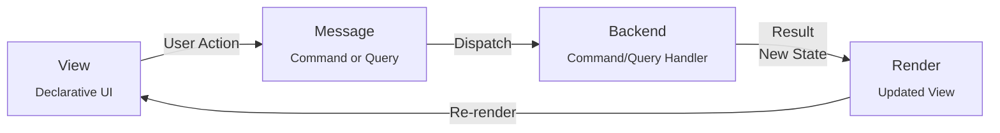

# MBV Architecture (Message → Backend → View) — **Full Technical Blueprint**

---

### 1. Conceptual Overview

```
┌───────────┐   ①User Action   ┌────────────┐ ②Dispatch  ┌────────────┐
│   View    │ ───────────────► │  Message   │───────────►│  Backend   │
│(Skia UI)  │                  │(Command/   │            │Logic & I/O │
└───────────┘                  │  Query)    │            └────────────┘
      ▲                         └────────────┘ ③Result           │
      │                                │                         │
      │                ④New Model/Data │                         │
      └────────────────────────────────┴──────── Re‑render ◄─────┘
```



* **Unidirectional flow** eliminates hidden side‑effects.
* **Messages** are *the only* way the UI talks to code; every mutation is explicit, loggable, and testable.
* **Backend** logic is written **once** and exposed through **two interchangeable transports**:

  * **Fast in‑process** dispatch (production)
  * **HTTP + Swagger/OpenAPI** (development / automation)

---

\### 2. Core Building Blocks

| Layer                | Responsibility                                                                                                          | Key Types & Libraries                                           |
| -------------------- | ----------------------------------------------------------------------------------------------------------------------- | --------------------------------------------------------------- |
| **View**             | Skia‑based canvas renderer + declarative DSL. 100 % passive; emits messages and draws from state.                       | `SkiaSharp`, Flex‑box engine (`Taffy`/Yoga), Hot‑reload runtime |
| **Message**          | Immutable DTO representing an *intent* (**Command**) or *request for data* (**Query**).                                 | `record` types, JSON‑serialisable                               |
| **MessageBus**       | Discovers handlers and dispatches messages to backend. Provides two pipelines: **InProc** / **HTTP**.                   | Generic resolver + middleware chain                             |
| **Backend**          | Pure application logic, file/network I/O, state transitions. Written once in `ICommandHandler<T>` / `IQueryHandler<T>`. | ASP.NET Core, MediatR‑style helpers, DI container               |
| **Store (optional)** | Zustand‑style state cache inside the View process. Receives results, emits change notifications.                        | Custom `AppStore` class using events/observables                |

---

\### 3. Directory / Solution Layout

```
/MyApp
├── Frontend/
│   ├── Program.cs             # Boot window & Skia surface
│   ├── SkRenderer.cs          # Scene graph → Skia
│   ├── UiDsl/                 # .skx files + parser
│   └── State/                 # Zustand‑style store
├── Backend/
│   ├── Handlers/              # Command & Query handlers
│   ├── Controllers/           # HTTP endpoints (1‑to‑1 thin wrappers)
│   ├── Backend.csproj         # ASP.NET Core host
│   └── MessageBus.cs          # In‑proc dispatcher + middleware
├── Shared/
│   ├── Commands/              # e.g. SaveNoteCommand.cs
│   ├── Queries/               # e.g. GetUserQuery.cs
│   └── Contracts.csproj       # Referenced by both ends
├── Tools/
│   ├── mbv-cli/            # dev, build, docgen commands
│   └── scripts/               # CI helpers
└── MyApp.sln
```

---

\### 4. Startup Sequence

1. **Backend host** starts **in‑process** (`Host.CreateDefaultBuilder`) and binds to **port 0** (dynamic) **or** a named pipe.
2. Selected port / pipe name is written to a temp file:

   ```json
   { "transport":"inproc", "endpoint":"pipe://mbv_54321" }
   ```
3. **Frontend** reads this marker, instantiates a **MessageBusClient** with appropriate transport.
4. UI DSL is parsed → scene graph → first render.
5. User interacts → `MessageBus.Send(cmd)` → backend handler → response → store update → diff renderer → Skia draws.

---

\### 5. Command / Query Contracts

```csharp
// Shared/Commands/SaveNote.cs
public record SaveNoteCommand(string Title, string Content);
public record SaveNoteResult(bool Success, Guid Id);

// Backend/Handlers/SaveNoteHandler.cs
public class SaveNoteHandler : ICommandHandler<SaveNoteCommand, SaveNoteResult>
{
    public Task<SaveNoteResult> Handle(SaveNoteCommand c) {
        // persistence, validation …
        return Task.FromResult(new SaveNoteResult(true, Guid.NewGuid()));
    }
}
```

* HTTP endpoint (dev only) maps 1‑to‑1:

  ```csharp
  [HttpPost("save-note")] public Task<SaveNoteResult> Save([FromBody]SaveNoteCommand c)
      => _bus.Send(c);
  ```
* **Swashbuckle** auto‑generates the OpenAPI JSON; `mbv docgen` copies it to `/docs/api.yaml`.

---

\### 6. In‑Process MessageBus (Fast Path)

```csharp
public class MessageBus : IMessageBus
{
    private readonly IServiceProvider _di;
    public Task<TResult> Send<TCommand, TResult>(TCommand cmd) =>
        ((ICommandHandler<TCommand,TResult>)_di.GetService(
            typeof(ICommandHandler<TCommand,TResult>)))
        .Handle(cmd);
}
```

*Pluggable middlewares* (logging, validation, metrics) are injected via decorator chain.

---

\### 7. HTTP Transport (Dev/Test Path)

* Hosted inside same process but **disabled for production builds** (behind `#if DEBUG`).
* Uses **Kestrel** with `UseUrls("http://127.0.0.1:0")`.
* Frontend may call endpoints for *integration tests* or *external automation scripts*.

---

\### 8. Zustand‑Style Store (Frontend)

```csharp
public class AppStore
{
    public IReadOnlyList<NoteDto> Notes => _notes;
    private readonly List<NoteDto> _notes = new();

    public async Task AddNote(string title, string content)
    {
        var res = await _bus.Send<SaveNoteCommand, SaveNoteResult>(
                      new(title, content));
        if (res.Success) _notes.Add(new NoteDto(res.Id, title, content));
        Notify();
    }
}
```

*No reducers*; direct methods keep boilerplate minimal.

---

\### 9. Developer Experience & Tooling

| Command         | Purpose                                                       |
| --------------- | ------------------------------------------------------------- |
| `mbv dev`    | Hot‑reload UI + backend (HTTP enabled, Swagger at `/swagger`) |
| `mbv test`   | Spins up backend in‑proc, runs xUnit tests hitting handlers   |
| `mbv docgen` | Exports combined OpenAPI + mermaid diagrams for docs          |
| `mbv build`  | Publishes single‑file exe (HTTP layer stripped)               |

*Live UI Inspector* shows current store snapshot & message log (similar to Redux DevTools).

---

\### 10. Extensibility Hooks

* **Additional Transports**: swap HTTP for gRPC or WebSocket with a single adapter.
* **Plugins**: backend scans DLLs for additional `ICommandHandler<>` implementations.
* **Remote UI**: because contracts are HTTP‑ready, a web SPA or mobile shell can reuse backend unchanged.

---

\### 11. Mermaid Flow Diagram

```mermaid
flowchart LR
    V[View\n(Declarative)] -->|User Action| M[Message\n(Command/Query)]
    M -->|Dispatch| B[Backend\nHandlers]
    B -->|Result\nNew State| S[Store]
    S -->|Update| V
    click B href "swagger_ui_or_docs_here" "OpenAPI Docs"
```

---

\### 12. Key Advantages

1. **Performance** – In‑proc dispatch ≈ sub‑100 µs, no socket overhead.
2. **Clarity** – Messages make side‑effects obvious and traceable.
3. **Testability** – Same handlers reachable via unit tests *and* Swagger.
4. **Flexibility** – Transport, renderer, or state layer can all evolve independently.
5. **On‑boarding** – Frontend devs see familiar SPA flow; backend devs see clear C(Q)RS boundaries.

---
